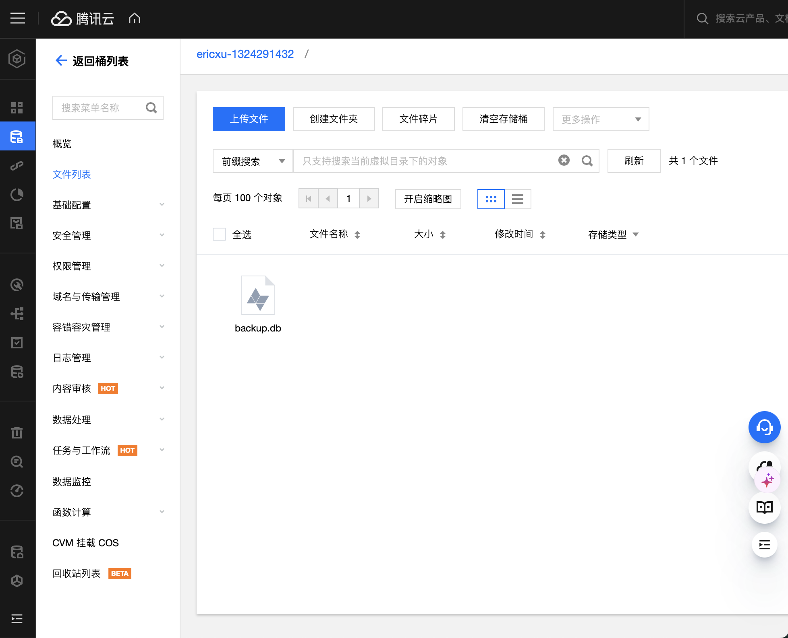

---
# Sends Training Project 文档

## 项目结构

```
SendsTraningProject/
│
├── flask/                  # Flask应用文件
│   ├── templates/          # 包含home.html与layout.html
│   ├── app.py              # 程序
│   ├── backup.sh           # 用于备份数据的脚本
│   └── dockerfile          
│
├── scrapper/               # 爬虫
│   ├── scrapper.py         # 爬虫程序 
│   └── dockerfile
│
├── nginx/                  # Nginx相关文件   
│   
└── docker-compose.yml
```
## 任务实现

### 爬虫容器
使用基于python3.8镜像的容器，将工作目录设置为/app，并将当前目录内文件全部移动到/app中。通过运行 `pip install --no-cache-dir -r requirements.txt -i https://mirrors.aliyun.com/pypi/simple/` 安装依赖。
之前下载出现网络问题，所以这里选择指定阿里云镜像源。
创建并确保用于存放数据库文件的路径 `/var/lib/sqlite` 存在，没注意就报错了。
同时，我们在这里声明容器暴露80端口。

```
EXPOSE 80 # 这样声明没有办法主动开放80端口，但是是一个好的习惯
```

我的爬虫使用了 BeautifulSoup 和 requests 库，数据库使用了 sqlite。运行 `scrapper()` 函数从华侨大学新闻页面爬取内容，处理响应内容，并将新闻的标题和链接存入 sqlite 数据库。
```
from bs4 import BeautifulSoup
import requests from flask_sqlalchemy
import SQLAlchemy from flask import Flask
```
其中SQLAlchemy是Python的SQL工具包
```从华大新闻官网爬取内容
with app.app_context():
    db.create_all()

def scrapper():
    #上下文
    with app.app_context():
        # 这个scrapper() 函数首先使用 requests 库向给华侨大学新闻页面发起请求
        url = "https://news.hqu.edu.cn/hdyw.htm"
        response = requests.get(url)
        html_content = response.content.decode('utf-8')
        # 解码返回的内容，并使用 BeautifulSoup 将内容解析为 lxml 格式
        soup = BeautifulSoup(html_content, 'lxml')
        news_list = soup.find_all('a')
        # 遍历所有的新闻链接（a 标签），获取新闻的标题和链接
        for news in news_list:
            title = news.text
            link = news['href']
            link = 'https://news.hqu.edu.cn/' + link
            existing_news = NewsData.query.filter_by(link=link).first()
                # 检查这条新闻是否已经存在于数据库中
            if existing_news is None:
                # 如果不存在，就创建新的 NewsData 对象
                news_data = NewsData(title=title, link=link)
                # 将其添加到数据会话（db.session）中。
                db.session.add(news_data)
                # 需要注意的是这并不会立即将数据保存到数据库，要实际保存这些对象到数据库需要调用 db.session.commit()
        db.session.commit()

if __name__ == "__main__":
    scrapper()
```

### Flask web应用容器
Flask 定义：基于Python类定义的Web应用框架。与爬虫应用的初始化操作相同。在服务器配置中使用自签名证书。这里选择了Nginx作为反向代理，详情参见 `nginx/` 下的 `hdxw.conf`。
首先在dockerfile中用RUN指令更新安装器并安装一些工具:
```用到这些工具的原因之后会进行说明
RUN apt-get update && apt-get install -y unzip sqlite3 cron nano
```
最后就是使用CMD命令启动flask应用
在Flask web应用的入口文件,这里是'app.py',中
``` 首先定义/hdxw的路由，渲染网页

@app.route('/hdxw')
def home():
        
    all_news_data = NewsData.query.all()
    return render_template('home.html', news_data=all_news_data)

```
home.html就是主页文件;这里把数据库中的数据传递给了news_data, 这些数据在home.html中使用

---
如果项目比较大、运用相同的html布局比较多的话，可以考虑将重复的代码单独构成一个layout.html, 方便重复使用
我这里templates分为home.html和layout.html两个文件
```layout.html
<!DOCTYPE html>
<html>
<head>
    <title>华大新闻</title>
</head>
<body>
     
</body>
</html>

```
```home.html




<h1>华大新闻</h1>

<p>
    <a href="{{ news.link }}">{{ news.title }}</a>
</p>



```
运用了到Jinja来构建和扩展代码块

---
### Nginx容器
这里选择了Nginx作为反向代理
在sites-enabled下的hdxw.conf进行配置：
```在server块中;
listen 443 ssl # 设置监听443端口，部署https加密访问功能需要用到
```
然后这里因为我申请的域名审核还没通过，所以先用自签名证书；操作步骤：
1.创建私钥和公钥
```
openssl req -x509 -nodes -days 365 -newkey rsa:2048 -keyout mykey.key -out mycert.pem
```
执行之后生成cert.pem和key.pem两个文件(私钥和公钥或者说是'自签名证书')

2.在服务器配置中使用
```然后在这里指定cert.pem和key.pem的路径：
    ssl_certificate /etc/nginx/ssl/cert.pem;
    ssl_certificate_key /etc/nginx/ssl/key.pem;
```
由于我在docker-compose.yml将nginx文件链接到nginx容器的/etc/nginx
```
     - ./nginx:/etc/nginx
```
所以网页的根目录选择在nginx容器的/etc/nginx/nginx_index:
```
    location / {
        root /etc/nginx/nginx_index;
    }
```
反向代理，可以将用户来自https://116.62.34.42/hdxw的请求转发到http://116.62.34.42:5000/hdxw：
```
    location / {
        proxy_pass http://116.62.34.42:5000;
    }
```
### 容器编排 Docker compose
flask服务:
```
  flask:
    build: ./flask #存放文件夹的目录，在docker-compose.yml下一级
    ports:
      - 5000:5000
    volumes:
      - data_volume:/var/lib/sqlite # 共享/var/lib/sqlite
      - ./backup.sh:/app/backup.sh # 将备份脚本backup.sh移动入容器
    restart: unless-stopped # 停止之后会自动重启
    logging:
      driver: "json-file" 
      options:
        max-size: "3m" 
        max-file: "1"
```
 由于要设置爬虫5分钟自动运行一次，所以我们希望爬虫容器不会因为程序运行后结束就重启或关闭；
 restart设置为no  
```
    #而对于爬虫，不需要端口映射，但也需要访问/var/lib/sqlite下的数据库
    volumes:
      - data_volume:/var/lib/sqlite 
```
其他方面大致相同

 nginx服务:

```
  nginx:
    build: ./nginx
    ports:
      - 80:80 # 开放80端口，用于访问网站
      - 443:443 # 开放443端口用于ssl验证
    volumes: #链接方式
      - ./nginx:/etc/nginx
```
其他方面大致相同

## 其他任务

### 对新闻数据 5min 进行一次更新：
设置定时任务，用Cron和Docker配合使用，从主机上执行 cron 任务 `*/5 * * * * docker run --rm sendstrainingproject-scrapper`。
注意这里的操作不是重启容器docker restart，因为执行docker restart后容器会继续运行并保持原有的状态，不会执行新的命令
这样5min启动一次爬虫容器就能自动更新爬取的数据了

### 定时导出数据，用Rclone上传腾讯云对象存储
在dockfile中用RUN命令在flask容器中安装了Rclone工具和cron，用于定时上传数据；安装nano文本编辑器用于编辑crontab的定时任务
```编辑crontab任务
crontab -e
```
```最后一行添加
*/10 * * * * /bin/bash /app/backup.sh
```
backup.sh中的内容:
```
#!/bin/bash

# 备份 SQLite 数据库
sqlite3 /var/lib/sqlite/test.db ".backup '/var/lib/sqlite/backup.db'"

# 删除云存储上的旧备份文件
rclone delete ericxu:/ericxu-1324291432/backup.db

# 上传新的备份文件到云存储
rclone copyto /var/lib/sqlite/backup.db ericxu:/ericxu-1324291432/backup.db
```
但第一次执行脚本之前还需先配置rclone
先到服务商官网开通对象存储服务，创建自己的存储桶之后生成secretkey和secretid；
我选择的是腾讯云
接着
```
rclone config
```

成功后运行脚本应该能在自己的服务商官网对象存储里看到上传的文件了
我的腾讯云s3存储桶为例:


 ## 一些问题的解决

- RUN命令安装package之前要先apt-get update更新包列表，否则有些包没法搜索下载到

- 注册了ericxu.fun域名并绑定服务器访问ip, 但icp备案一直没通过
用自签名证书解决

- 因为从这个任务的实际应用出发，如果只是爬取最新的新闻而不需要调取往期的新闻，那么存入db的时候覆盖掉原有数据就行了，可以节省空间。
这样如果备份脚本中不加入rclone delete ericxu:/ericxu-1324291432/backup.db，默认也会覆盖先前的数据。但是直接覆盖可能也会出现重叠的部分，所以我选择直接删除旧备份文件再上传新备份文件

- Git的用法一开始搞错了，后面重做:
```
git clone git@github.com:Ericaire/-2024- # 将远程仓库中的目录克隆下来(这里的"-2024-"是)
然后把所有需要上传的文件移动到生成的"-2024-"文件夹 
git add . # 添加所有的文件到
git commit -m "messages" #提交并附信息
git push 上传提交
```
最后只保留两个分支：main和dev
  
- docker-compose.yml中nginx容器用到的文件较多，可以考虑直接将原nginx文件夹链接到容器中，而不是每个文件都单独进行链接
```
    volumes: #链接方式
      # - ./nginx/nginx.conf:/etc/nginx/conf.d/default.conf
      # - ./nginx/proxy_params:/etc/nginx/proxy_params
      # - ./nginx/nginx_index:/var/www/Nginx_Index
      # - ./nginx/nginx.conf:/etc/nginx/nginx.conf
      # - ./nginx/cert.pem:/etc/nginx/cert.pem
      # - ./nginx/key.pem:/etc/nginx/key.pem
      - ./nginx:/etc/nginx
```

- 应用上下文

一开始我不知道运行爬虫flask应用要添加上下文，后来引起了报错；
Flask 使用上下文为特定请求处理过程提供临时的全局变量，而某些 Flask 对象（如 g、request、current_app 等）的使用必须在上下文中。
db.create_all() 和 db.session.add(news_data)、db.session.commit() 这几个操作都涉及到了数据库的操作。这些操作需要 Flask 的应用上下文，因为 Flask 需要知道是哪个应用在进行这个请求。
with app.app_context(): 这行代码就是创建了一个应用上下文。
一般情况下，运行一个 Flask 应用并接收到 HTTP 请求时，Flask 会自动为这个请求创建和管理一个请求上下文。也就是说，在请求被处理的过程中，Flask 已经自动管理了上下文的创建和销毁。但是我们把flask web应用和爬虫应用分离了，所以是在一个独立的脚本中运行爬虫，而不是在 Flask 处理 HTTP 请求的过程中。这段脚本与 Flask web 服务器运行在不同的环境中，没有 HTTP 请求上下文，因此需要手动创建应用上下文。

